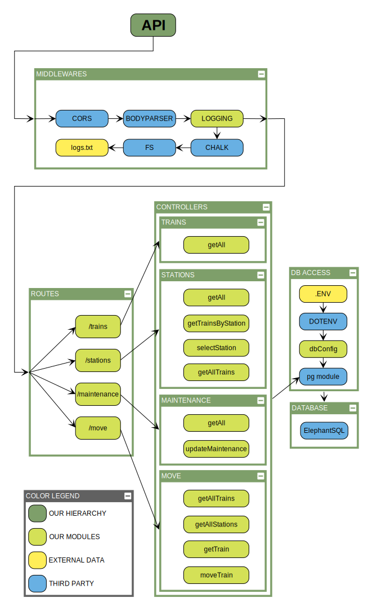

# WBS Coding School Groupwork
## Railway Network Simulation

## Group Members
[Jan](https://github.com/Scirius), [Zee](https://github.com/zeelib1), [Thomas](https://github.com/ThomasRinke82) & [Josh](https://github.com/koedukativ)

# Stack
* [Node.js](https://nodejs.org/)
* [REACT.JS](https://reactjs.org/) (User Interface)
* [Express](https://expressjs.com/) (Back-End API)
* CSS (Minimal Styling)
* GIT/GITHUB (Branches per Functionality)
* SQL (Database Management)

# Features
* Load train and station information from a database
* Load information about trains ar a specific station
* Send one or multiple trains to maintenance
* Move one or multiple trains to other stations
* Backend Integration via [our own API](https://github.com/koedukativ/railway_api)

________________________________________________
# Structure

File               | Description
------------------ | -------------
index.js           | React.JS base file
App.js             | Base app implementing sidebar navigation and routing
APIConfig          | Global Settings for the baseURL
ViewGeneral        | Displays all available trains and stations
ViewTrainByStation | Displays all trains at a specified station
ViewMaintenance    | Displays all trains and allows to toggle maintenance status
ViewTrainMover     | Displays all trains and allows to move to different stations
Controllers        | Generate the SQL for the dbConnection to ElephantSQL
routes             | Create the Endpoints for API Calls

# Credits

* Node-graphs are created with the free online tool by [yworks](https://live.yworks.com/demos/layout/layoutstyles/index.html)
* also see the newer, advanced version [yEd live](https://www.yworks.com/yed-live/)
* SQL Data is hosted at [ElephantSQL](https://www.elephantsql.com)

# Have fun!

Best Regards,
Zee, Jan, Thomas & Josh
